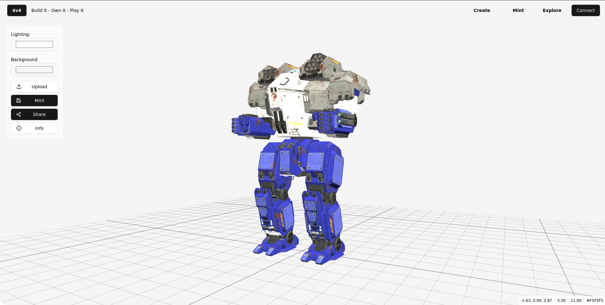

**4V4** is a digital playground for 3D avatars, built on the Stacks blockchain. This full-stack dApp enables users to mint, list, and trade 3D avatars as NFTs using STX or other SIP-010 tokens—plus future support for sBTC. It demonstrates how to build scalable and expressive NFT platforms using Clarity smart contracts, Next.js, and the Hiro Platform.

⚠️ This project is intended for educational and development purposes only. Contracts have not been audited for production.

---

## 🔥 Features

- Mint 3D avatars to user wallets as NFTs
- List avatars for sale with optional takers, expiry, or batch operations
- Trade NFTs using STX, SIP-010 tokens, and (soon) sBTC
- Supports royalties per NFT via `get-royalty-info`
- Secure SIP-009 ownership and transfers
- Pagination for listings
- Hiro wallet integration for devnet testing

---

## 🚀 Getting Started

### Prerequisites

- [Hiro Platform](https://platform.hiro.so) account
- Node.js 18+ and npm/yarn/pnpm
- Recommended: [Clarinet](https://github.com/hirosystems/clarinet) + [Clarity VSCode Extension](https://marketplace.visualstudio.com/items?itemName=HiroSystems.clarity-lsp)

---

### 1. Start Devnet via Hiro Platform

- Log in at [platform.hiro.so](https://platform.hiro.so)
- Start Devnet inside your project
- Copy the API Key from the Devnet API or Settings page

---

### 2. Clone and Set Up Project Locally

```bash
git clone https://github.com/fabohax/4v4-stx.git
cd 4v4/clarity
npm install

cd ../front-end
npm install
cp .env.example .env
```

Add your Hiro Platform API key to `.env`:

```
NEXT_PUBLIC_PLATFORM_HIRO_API_KEY=your-api-key-here
```

---

### 3. Run the Frontend

```bash
npm run dev
```

Visit [http://localhost:3000](http://localhost:3000) to use the marketplace UI.

---

## 🧲 Testing with Devnet

Devnet is a sandboxed blockchain for testing dApps. It resets every time you restart it, so use it to test all features before moving to testnet/mainnet.

### 1. Deploy Contracts

- Inside Hiro Platform, hit **Start Devnet**
- Your contracts (`avatar-minter.clar` and `4v4-marketplace.clar`) will deploy automatically

### 2. Test Contracts

- Use “Call Functions” inside Devnet
- Try minting an avatar, listing it, and fulfilling listings
- Watch for events and state changes on the dashboard

### 3. Test Frontend Integration

- With Devnet running and frontend live (`npm run dev`)
- Interact with the marketplace: mint, list, and buy 3D avatars
- Check the blockchain explorer view in Hiro Platform to confirm transactions

---

## 🗱️ Clarity Contracts

- `avatar-minter.clar`: SIP-009 NFT contract for avatar minting
- `4v4-marketplace.clar`: Fully featured NFT marketplace with batch listings, royalties, pagination, SIP-010 & STX support

---

## 🌐 Next Steps

### Move to Testnet

1. Get STX from [Testnet Faucet](https://explorer.hiro.so/sandbox/faucet?chain=testnet)
2. Deploy contracts to testnet via Hiro Platform
3. Update `.env` to use testnet API URL
4. Confirm interactions via [Testnet Explorer](https://explorer.hiro.so/?chain=testnet)

---

### Launch on Mainnet

1. Acquire real STX tokens for deployment
2. Update deployment settings to mainnet
3. Deploy contracts and test thoroughly
4. Point frontend to mainnet API
5. Launch 4V4 to the world 🌐

⚠️ Mainnet transactions are irreversible. Ensure contracts and UI are 100% tested and verified.

---

OSS Built with ❤️