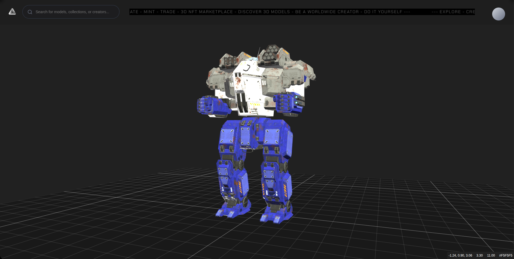

**4V4** is a digital playground for 3D mods, built on the Stacks blockchain. This full-stack dApp enables users to mint, list, and trade 3D models as NFTs using L2 satoshis. It demonstrates how to build scalable and expressive NFT platforms using Clarity smart contracts, Next.js, and Hiro.

⚠️ This project is intended for development purposes only. Contracts have not been audited for production.

---

## 🔥 Features

- Mint 3D avatars to user wallets as NFTs
- List avatars for sale with optional takers, expiry, or batch operations
- Trade NFTs using STX, SIP-010 tokens, and (soon) sBTC
- Supports royalties per NFT via `get-royalty-info`
- Secure SIP-009 ownership and transfers
- Pagination for listings
- Hiro wallet integration for devnet testing

---

## 🚀 Getting Started

### Prerequisites

- [Hiro Platform](https://platform.hiro.so) account
- Node.js 18+ and npm/yarn/pnpm
- Recommended: [Clarinet](https://github.com/hirosystems/clarinet) + [Clarity VSCode Extension](https://marketplace.visualstudio.com/items?itemName=HiroSystems.clarity-lsp)

---

### 1. Start Devnet via Hiro Platform

- Log in at [platform.hiro.so](https://platform.hiro.so)
- Start Devnet inside your project
- Copy the API Key from the Devnet API or Settings page

---

### 2. Clone and Set Up Project Locally

```bash
git clone https://github.com/fabohax/4v4-stx.git
cd 4v4/clarity
npm install

cd ../front-end
npm install
cp .env.example .env
```

Add your Hiro Platform API key to `.env`:

```
NEXT_PUBLIC_PLATFORM_HIRO_API_KEY=your-api-key-here
```

---

### 3. Run the Frontend

```bash
npm run dev
```

Visit [http://localhost:3000](http://localhost:3000) to use the marketplace UI.

---

OSS Built with ❤️